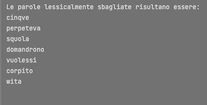

# Skiplist

## Generalità
La skiplist è una struttura dati probabilistica composta da una linked list in cui ogni nodo a sua volta
ha un insieme di riferimenti a nodi successivi non per forza adiacenti, il significato semantico di queste connessioni
extra è la creazione di vie "express" che permettono salti in avanti nella ricerca.

Ciò è possibile anche grazie all'assunzione che sia una lista di elementi ordinati.

La nuova possibilità di avere salti nella struttura dati velocizza l'operazione di ricerca nella struttura dati dando 
la possibilità di avere ricerche in O(log n) in una struttura simile alla linked list dove la ricerca richiederebbe tempo
lineare O(n)

## Metodo di sviluppo

## Uso richiesto con il file da correggere ed il dizionario

Caricando i dati del file dizionario sulla skip list è possibile poi andare a scrutare parole mancanti in una data frase, 
il meccanismo è semplice :

l'operazione di search nella struttura dati richiesta ritorna o l'oggetto ricercato o un valore null, effettuando una ciclo
sull'array contenente le 49 parole della frase da correggere al cui interno viene effettuata una singola operazione di search 
skiplist è possibile controllare se il ritorno della ricerca sia null e in quel caso stampare la parola non trovata.

In questo modo otteniamo quelle che son le parole lessicalmente sbagliate nel nostro dizionario.

Una nota: è stato necessario effettuare una piccola operazione di trasformazione in lower case di alcune parole della frase
in modo che la ricerca non intelligente fosse in grado di riconoscere i token dell'array di char uno ad uno. Passo necessario
per parole successive ad un punto.

Queste son le parole che secondo il nostro algoritmo risultano sbagliate e un piccolo confronto manuale del file conferma 
che le parole sbagliate siano effettivamente queste:

## Effetti della variazione del MAX_HEIGHT

La variazione del parametro MAX HEIGHT a livello strutturale fornisce con il suo aumentare numeri maggiori di vie espresse
attraverso cui è possibile effettuare la ricerca. 

Questo fattore va poi ad influire sul tempo in cui vengono fatte sia le operazioni di ricerca che di inserimento, con un valore al di sopra
di MAX HEIGHT 15 iniziamo ad avvicinarci sempre di più al limite superiore di O(log n) sia per le operazioni di ricerca che inserimento.

In contrasto abbassando il valore del parametro sotto la soglia citata andiamo ad osservare un comportamento molto più simile
alle ricerche in tempo lineare, questa fenomeno combacia con il lato strutturale della skip list, di fatti abbassando fino
ad 1 il MAX HEIGHT descriviamo man mano sempre di più una linked list lineare.

